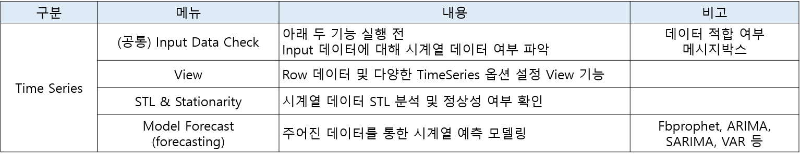
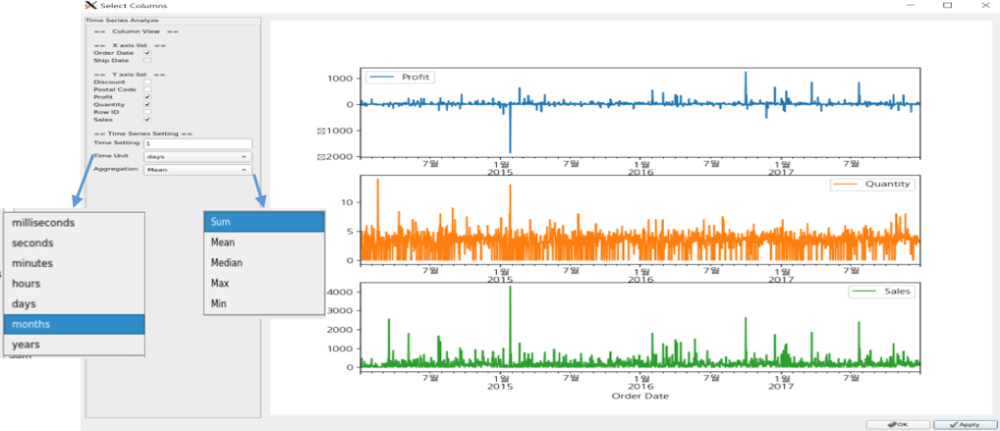
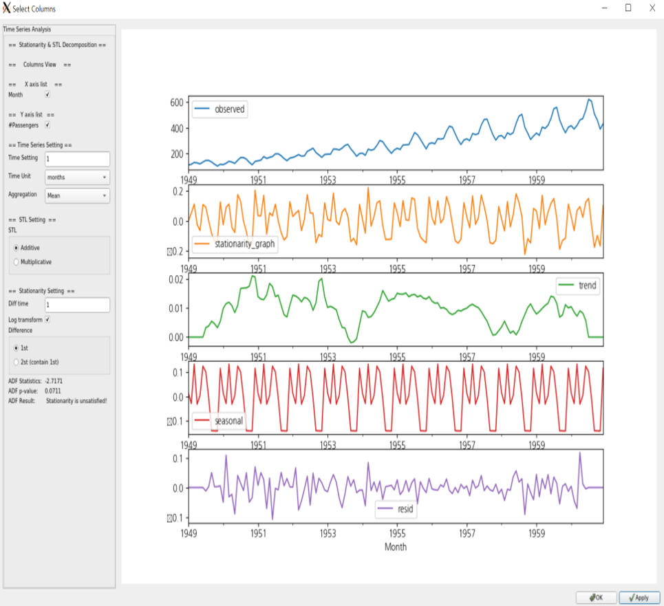
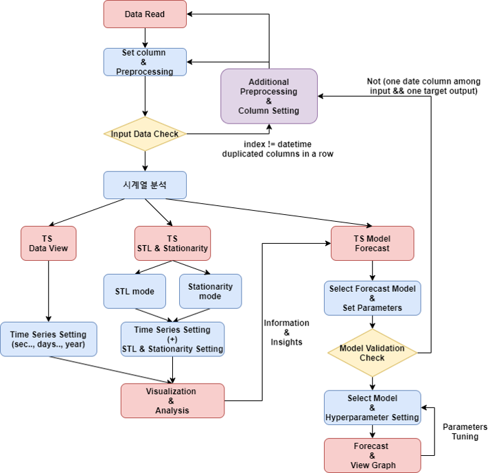

## 스마트 팩토리 AI 플랫폼 TimeSeries Part 개발
- 2주차 : Timeseries 사전조사
    - 기간 : 21.01.11 ~ 21.01.15
  - Time Series 분석 Process 이해 (o)
  - 참고자료
    - https://otexts.com/fppkr/tspatterns.html
    - https://rfriend.tistory.com/510
    
- 3주차 : 기능 설계도 Document 작성
    - 기간 : 21.01.18 ~ 21.01.22
    - Process 항목별 기능 설정 (o)
    - UI 가안 작성 (o) 
    - 전체, 부분 Flow Chart 작성 (o)
    - 개발 Tools 예제 (o)
        - UI - PyQt5
            - https://wikidocs.net/book/2165
            - https://github.com/SeonminKim1/Python_GUI

- 4주차 ~ 8주차 : TimeSeries Part 개발
    - 기간 : 21.01.25 ~ 21.02.26
    - 기술 Stack : Python, pyqt, statsmodels(timeseries), make
    - 기능
        - 최종 기능별 정의서는 '연수생_최종보고서_김선민_0226.pptx' 에 있음
        
        - 시계열데이터 특징 고려한 Input Data Check (o)    
        - Data View (o)
        

        - Data Resampling (o)
        - Data Decomposition 분석 (o)
        - Data Stationaroty View (o) 
        

- 전체 Flow Chart

